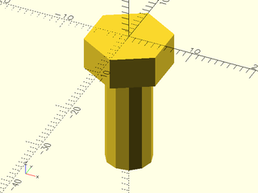

# File: bolt.scad

A simple bolt component for holding the Best Fence, used by the [toe_clamp_body](parts/toe_clamp_body.scad)

To use, add the following lines to the beginning of your file:

    use <hardware/bolt.scad>;

## File Contents

- [`bolt`](#module-bolt)


### Module: bolt

**Usage:** 

- bolt();

**Description:** 

A simple bolt for holding the Best Fence, used by the [toe_clamp_body](parts/toe_clamp_body.scad)
This module creates a simple bolt with a hex head and no threads.

**Example 1:** 

``` {.C linenos=True}
use <hardware/bolt.scad>;
bolt();
```



---

