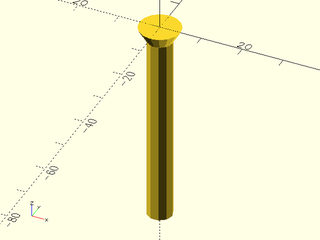

# File: screw.scad


To use, add the following lines to the beginning of your file:

    use <hardware/screw.scad>;

## File Contents

- [`screw`](#module-screw)


### Module: screw

**Usage:** 

- screw();

**Description:** 

A simple screw for holding the Best Fence, used by the [attachment_screw](tools/attachment_screw.scad)
This module creates a simple screw with a tapered head and no threads.

**Example 1:** 

``` {.C linenos=True}
use <hardware/screw.scad>;
screw();
```



---

