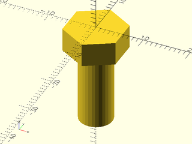

# File: bolt.scad

A simple bolt component for holding the Best Fence, used by the [toe\_clamp\_body](models/toe_clamp_body.scad#module-toe_clamp_body)

To use, add the following lines to the beginning of your file:

    include <models/bolt.scad>;

## File Contents

- [`bolt`](#module-bolt)


### Module: bolt

**Description:** 

A simple bolt for holding the Best Fence, used by the [toe\_clamp\_body](models/toe_clamp_body.scad#module-toe_clamp_body)
This module creates a simple bolt with a hex head and no threads.

**Example 1:** 

``` {.C linenos=True}
include <models/bolt.scad>;
bolt();
```



---

