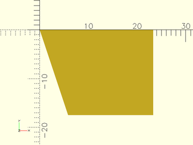

# File: toe\_clamp\_body.scad

A simple toe clamp component for holding the Best Fence, used by the [mount](models/mount.scad#module-mount)

To use, add the following lines to the beginning of your file:

    include <models/toe_clamp_body.scad>;

## File Contents

- [`toe_clamp_body`](#module-toe_clamp_body)
- [`_calculate_toe_clamp_body_points`](#function-_calculate_toe_clamp_body_points)
- [`_calculate_center_x_toe_clamp_body`](#function-_calculate_center_x_toe_clamp_body)


### Module: toe\_clamp\_body

**Description:** 

A simple toe clamp for holding the Best Fence, used by the [mount](models/mount.scad#module-mount)
This module creates a simple toe clamp body that takes the [toe\_clamp\_insert](models/toe_clamp_insert.scad#module-toe_clamp_insert) and a bolt as children
This module is centered around 0,0,0, meaning all children should be centered about 0,0,0 as well.
to secure the clamp to the fence. The clamp body is designed to fit snugly around the insert and provide a secure hold on the fence.
it is recommended to make the body from a rubbery/grippy material like TPU

**Example 1:** 

``` {.C linenos=True}
include <models/toe_clamp_body.scad>;
toe_clamp_body() {
  translate([0, 0, EPSILON]) {
    bolt();
    toe_clamp_insert() {
     translate([0, 0, EPSILON]) {
        bolt();
      }
    }
  }
}
```


---

### Function: \_calculate\_toe\_clamp\_body\_points

**Status:** INTERNAL


**Description:** 

Calculates the points for the toe clamp body geometry based on global variables

**Example 1:** 

``` {.C linenos=True}
include <models/toe_clamp_body.scad>;
polygon(points_to_coords(_calculate_toe_clamp_body_points()));
```



---

### Function: \_calculate\_center\_x\_toe\_clamp\_body

**Status:** INTERNAL


**Description:** 

Calculates the center x coordinate for the toe clamp body geometry based on the points

**Example 1:** 

``` {.C linenos=True}
include <models/toe_clamp_body.scad>;
_calculate_center_x_toe_clamp_body(_calculate_toe_clamp_body_points());
```

---

