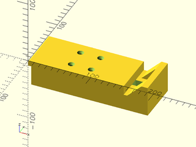
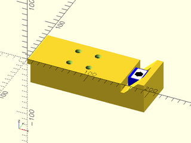

# File: saw\_horse\_connector.scad

A simple connector for attaching the Best Fence to a saw horse

To use, add the following lines to the beginning of your file:

    include <parts/saw_horse_connector.scad>;

## File Contents

- [`saw_horse_connector`](#module-saw_horse_connector)


### Module: saw\_horse\_connector

**Description:** 

A simple connector for attaching the Best Fence to a saw horse

**Example 1:** Exported Geometry

``` {.C linenos=True}
include <parts/saw_horse_connector.scad>;
saw_horse_connector();
```



**Example 2:** Full Assembly

``` {.C linenos=True}
include <parts/saw_horse_connector.scad>;
saw_horse_connector() {
    union() {
        rotate([0, 0, 180]) {
            color("blue") {
                toe_clamp_body(){
                    translate([0, 0, EPSILON]) {
                        bolt();
                        toe_clamp_insert() {
                            translate([0, 0, EPSILON]) {
                                bolt();
                            }
                        }
                    }
                }
            }
            color("white") {
                toe_clamp_insert() {
                    translate([0, 0, EPSILON]) {
                        bolt();
                    }
                }
            }
            color("black") {
                bolt();
            }
        }
    }
}
```



---

