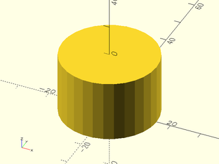

# File: attachment\_helping\_hand.scad


To use, add the following lines to the beginning of your file:

    use <tools/attachment_helping_hand.scad>;

## File Contents

- [`attachment_helping_hand`](#module-attachment_helping_hand)


### Module: attachment\_helping\_hand

**Usage:** 

- attachment_helping_hand();

**Description:** 

A cylindar the same size as the head of the "Helping Hand"
should be used as the first child of the [mount](parts/mount.scad) module, with `mounting_face` set to "BOTTOM"
derives its dimensions from the variables in config.scad

**Example 1:** 

``` {.C linenos=True}
use <tools/attachment_helping_hand.scad>;
attachment_helping_hand();
```



---

