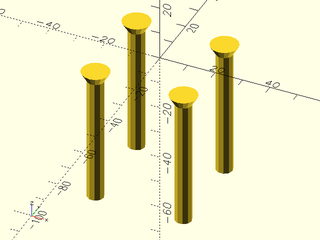

# File: attachment\_screw.scad


To use, add the following lines to the beginning of your file:

    use <tools/attachment_screw.scad>;

## File Contents

- [`attachment_screw`](#module-attachment_screw)


### Module: attachment\_screw

**Description:** 

A simple screw mount for the Best Fence, used to attach the mount to the
saw stand. This module creates a 2x2 group of screws using variables in config.scad
This should be the first child of the [mount](parts/mount.scad) module with `mounting_face` set to "TOP"

**Example 1:** 

``` {.C linenos=True}
use <tools/attachment_screw.scad>;
attachment_screw();
```



---

