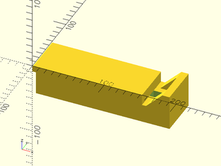
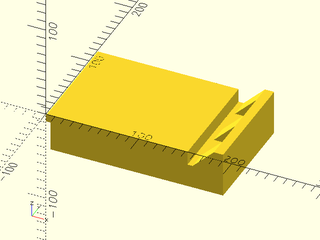

# File: mount.scad

This part interfaces with the BestFence system
It has slots for channels and a blind hole for a "helping hand" arm

To use, add the following lines to the beginning of your file:

    include <tools/mount.scad>;

## File Contents

- [`mount`](#module-mount)
- [`_validate_args_mount()`](#function-_validate_args_mount)
- [`_calculate_support_points()`](#function-_calculate_support_points)
- [`_calculate_channel_points()`](#function-_calculate_channel_points)


### Module: mount

**Usage:** 

- mount(num_channels=2, channel_spacing=20);

**Description:** 

Creates a mount for the BestFence system with specified number of channels and spacing.

uses global variables in config.scad to create the correct toe clamp, helping hand hole, and attachment geometry.

use children to add additional geometry to the mount. first child should be the attachment mechanism, the second child will
be duplicated in each `channel` slot.

**Arguments:** 

<abbr title="These args can be used by position or by name.">By&nbsp;Position</abbr> | What it does
-------------------- | ------------
`num_channels`       | `number` Number of channels to include in the mount (default: 2)
`channel_spacing`    | `number` Spacing between channels in mm (default: 20)
`mounting_face`      | `string` Which face to mount the channels on. Allowed values: "TOP", "BOTTOM" (default: "BOTTOM")

**Example 1:** One Channel, top mount



``` {.C linenos=True}
include <tools/mount.scad>;
mount(num_channels=1, channel_spacing=14, mounting_face="TOP");
```

**Example 2:** Two Channels, bottom mount



``` {.C linenos=True}
include <tools/mount.scad>;
mount(num_channels=2, channel_spacing=20, mounting_face="BOTTOM");
```

---

### Function: \_validate\_args\_mount()

**Status:** INTERNAL


**Description:** 

Validates the arguments passed to mount() and throws an error if any are invalid

**Arguments:** 

<abbr title="These args can be used by position or by name.">By&nbsp;Position</abbr> | What it does
-------------------- | ------------
`num_channels`       | `number` Number of channels to include in the mount (must be greater than 1, less than 11)
`channel_spacing`    | `number` Spacing between channels in mm (must be greater than 0)
`mounting_face`      | `string` Which face to mount the channels on. Allowed values: "TOP", "BOTTOM"

**Example 1:** Valid arguments

``` {.C linenos=True}
include <tools/mount.scad>;
// valid
_validate_args_mount(2, 20, "BOTTOM");
```

**Example 2:** Invalid `num_channels`

``` {.C linenos=True}
include <tools/mount.scad>;
_validate_args_mount(0, 20, "BOTTOM");
// throws error "Invalid num_channels value. Must be between 1 and 10."
```

**Example 3:** Invalid `channel_spacing`

``` {.C linenos=True}
include <tools/mount.scad>;
_validate_args_mount(2, -5, "BOTTOM");
// throws error "Invalid channel_spacing value. Must be greater than 0."
```

**Example 4:** Invalid `mounting_face`

``` {.C linenos=True}
include <tools/mount.scad>;
_validate_args_mount(2, 20, "SIDE");
// throws error "Invalid mounting_face value. Allowed values: 'TOP', 'BOTTOM'."
```

---

### Function: \_calculate\_support\_points()

**Status:** INTERNAL


**Description:** 

Calculates the points for the support geometry based on global variables

**Example 1:** 

``` {.C linenos=True}
include <tools/mount.scad>;
polygon(points_to_coords(_calculate_support_points()));
```

 Example 1")

---

### Function: \_calculate\_channel\_points()

**Status:** INTERNAL


**Description:** 

Calculates the points for the channel geometry based on global variables

**Example 1:** 

``` {.C linenos=True}
include <tools/mount.scad>;
polygon(points_to_coords(_calculate_channel_points()));
```

 Example 1")

---

